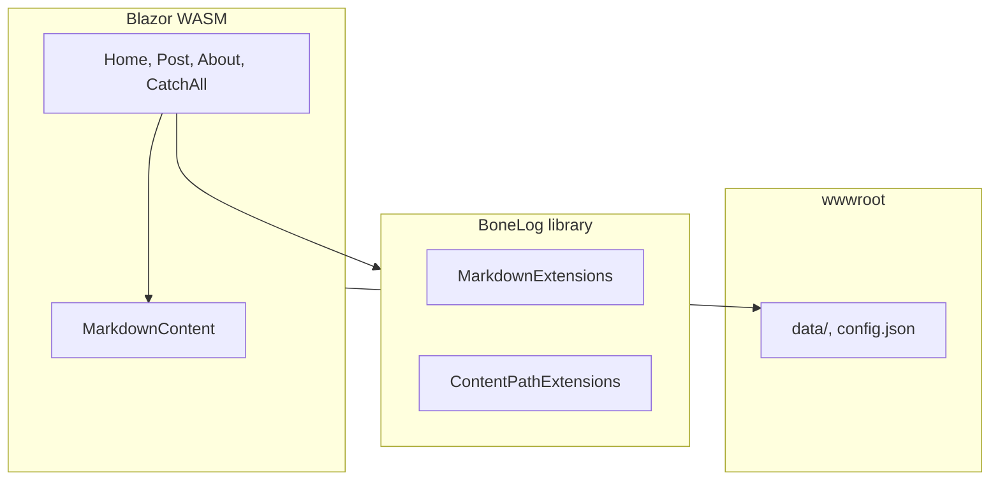

## Projects

| Project | Role |
|---------|------|
| `BoneLog` | Models, `BlogContentProvider`, markdown/path helpers. |
| `BoneLog.Blazor` | UI, static data, publish target. |
| `scripts/GenerateIndex.cs` | Builds `index.json` from front matter. |

## Content pipeline

1. Markdown + YAML → `MarkdownExtensions.ToPost` / `ToHtml`.
2. Mermaid → `
` → `boneLogMarkdown.render()` in the browser.
3. Relative assets → `ContentPathExtensions` → URLs under `data/` or `images/`.

## Routes

| Component | Route |
|-----------|--------|
| `PostPage.razor` | `/post/{*PostPath}` |
| `CatchAll.razor` | `/{**slug}` → `data/{slug}.md` |
| `Home.razor` | `/` |
| `About.razor` | `/about` |

## See also

- [Documentation index](Index)
- [Repository](https://github.com/Taqiam/BoneLog)
