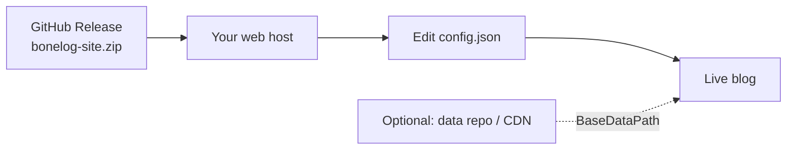

Use this guide when you **do not** rely on the fork + GitHub Actions flow. You take a **release build**, upload it to any static host, edit `config.json`, and optionally put `data/` on another server or repo.

**Related:** [Quick start (GitHub Pages)](Quick-Start) · [Paths & addresses](Paths) · [Publishing](Publishing)

---

## Overview



| Piece | What you control |
|-------|------------------|
| **Site files** | WASM app, `index.html`, `css/`, `_framework/` from the zip |
| **Content** | `data/`, `images/`, `config.json` (inside the zip or on another host) |
| **Settings** | `BaseDir`, `Paths.*` in `config.json` |

---

## Step 1: Download from Releases

1. Open [BoneLog Releases](https://github.com/Taqiam/BoneLog/releases) on GitHub.
2. Pick the latest tag (e.g. `v1.0.0`).
3. Download **`bonelog-site.zip`** (full published `wwwroot`).

The archive is produced by the **Release** workflow when a `v*` tag is pushed. It matches what gets deployed to `gh-pages`.

You can also build locally:

```bash
dotnet publish src/BoneLog.Blazor/BoneLog.Blazor.csproj -c Release -o release
# output: release/wwwroot/
```

---

## Step 2: Upload to your host

Extract the zip and upload **everything inside** `wwwroot` to your static host root (or subfolder).

Examples:

| Host | Upload target |
|------|----------------|
| **nginx / IIS** | Site root or virtual directory |
| **Netlify / Cloudflare Pages** | Publish directory = extracted folder |
| **S3 + CloudFront** | Bucket root |
| **GitHub Pages** | `gh-pages` branch root |

Enable **SPA fallback**: unknown routes should serve `index.html` (so `/post/...` works on refresh).

---

## Step 3: Set paths in `config.json`

Edit `config.json` on the deployed site (same folder as `index.html`).

### Site at domain root

```json
{
  "Title": "My Blog",
  "BaseDir": "/",
  "Paths": {
    "BaseDataPath": "data/",
    "PostsPath": "posts/",
    "IndexPath": "index.json",
    "AboutMePath": "AboutMe.md"
  }
}
```

### Site in a subfolder

Example: `https://example.com/blog/`

```json
{
  "BaseDir": "/blog/",
  "Paths": {
    "BaseDataPath": "data/",
    "PostsPath": "posts/",
    "IndexPath": "index.json",
    "AboutMePath": "AboutMe.md"
  }
}
```

`BaseDir` must start and end with `/`. It is read by `js/base-path.js` before the app loads.

Full reference: [Configuration](Configuration) · [Paths & addresses](Paths).

---

## Step 4: Same host vs separate data

### Option A: Everything on one host (simplest)

Keep the folder layout from the zip:

```text
/
├── index.html
├── config.json
├── data/
│   ├── index.json
│   ├── AboutMe.md
│   └── posts/
└── images/
```

Use `"BaseDataPath": "data/"`. No CORS setup. Update posts and `index.json` on this host when content changes.

### Option B: Separate data host (advanced)

Host **only the app** on your main domain. Put **`data/`** (and optionally `images/`) somewhere else, another bucket, server, or **a second GitHub repo**.

```json
{
  "BaseDir": "/",
  "Paths": {
    "BaseDataPath": "https://yourname.github.io/my-blog-data/",
    "PostsPath": "posts/",
    "IndexPath": "index.json",
    "AboutMePath": "AboutMe.md"
  }
}
```

The app will fetch:

- `https://yourname.github.io/my-blog-data/index.json`
- `https://yourname.github.io/my-blog-data/posts/.../*.md`
- etc.

Requirements:

- **HTTPS** recommended.
- **CORS**, the data host must allow requests from your main site origin.
- **`index.json` on the data host**, must stay in sync when you add or edit posts.

Details: [Paths separating the website and data](Paths#separating-the-website-and-data).

---

## Using a GitHub repo for data only

A common pattern: **Repo 1** = static site (from release zip). **Repo 2** = markdown + `index.json`, published with GitHub Pages.

### 1. Create a data repository

Example: `my-blog-data`

```text
my-blog-data/          ← repo root (published to Pages)
├── index.json
├── index.manifest.json   ← optional, from GenerateIndex
├── AboutMe.md
├── posts/
│   └── ...
└── images/               ← optional shared images
```

### 2. Publish data repo to GitHub Pages

**Settings → Pages** → deploy from `main` / root (or `gh-pages` branch).

Your data base URL becomes something like:

`https://yourname.github.io/my-blog-data/`

### 3. Point the main site at it

On the **site** host, edit `config.json`:

```json
{
  "BaseDir": "/",
  "Paths": {
    "BaseDataPath": "https://yourname.github.io/my-blog-data/",
    "PostsPath": "posts/",
    "IndexPath": "index.json",
    "AboutMePath": "AboutMe.md"
  }
}
```

### 4. Enable CORS on the data repo

GitHub Pages does not add CORS headers by default. Options:

- Put a **`_headers`** file (Netlify-style) if you front the data with Cloudflare Pages instead.
- Serve the data repo through **Cloudflare**, **nginx**, or another host where you set `Access-Control-Allow-Origin`.
- For testing only, some setups proxy data through the main site (same origin).

If the browser blocks fetches, check the developer console for CORS errors.

### 5. Update `index.json` when posts change

The home page reads `index.json` from `BaseDataPath`. After editing posts in the data repo:

**On your machine** (clone the data repo):

```bash
dotnet run scripts/GenerateIndex.cs -- \
  ./posts \
  ./index.json
```

Commit and push `index.json` (and `posts/`). GitHub Pages updates the live data URL.

**If posts stay in the main BoneLog repo**, use workflow **Update index on main**, then copy `data/index.json` and `data/posts/` into the data repo and push.

Do not skip this step, without an updated `index.json`, new posts will not appear on the home page.

---

## Checklist

| Step | Done |
|------|------|
| Downloaded `bonelog-site.zip` (or built locally) | ☐ |
| Uploaded to static host + SPA fallback | ☐ |
| Set `BaseDir` for your URL layout | ☐ |
| Set `BaseDataPath` (`data/` or full data URL) | ☐ |
| Edited `config.json` title, nav, features | ☐ |
| Regenerated `index.json` after post changes | ☐ |
| If split data: CORS works, data URL loads in browser | ☐ |

---

## Updating later

| Change | Action |
|--------|--------|
| New BoneLog version | Download newer release zip; replace site files (keep your `config.json` and `data/` backup). |
| New / edited posts | Regenerate `index.json`; upload to wherever `BaseDataPath` points. |
| Theme / CSS | Edit `css/app.css` on the site host, or customize before rebuild. |

---

## See also

- [Paths & addresses](Paths)
- [Publishing, releases & static hosting](Publishing)
- [GitHub Actions workflows](Workflows)
- [Documentation index](Index)
