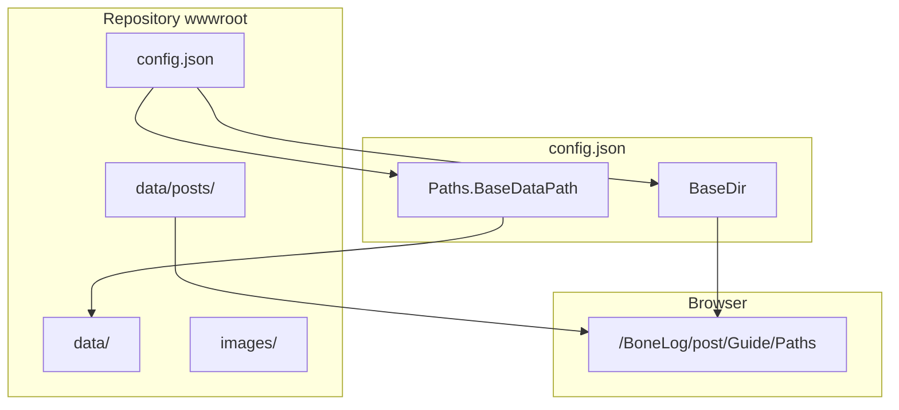
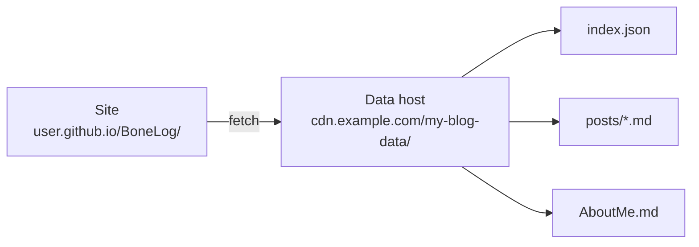

BoneLog uses **three related ideas** of “path.” This guide ties them together so nothing breaks when you deploy under a subfolder (e.g. GitHub Pages) or move files around.

| Concept | What it is | Example |
|---------|------------|---------|
| **File on disk** | Where you put `.md` / images in the repo | `wwwroot/data/posts/Guide/Paths.md` |
| **Browser URL** | What visitors open | `https://taqiam.github.io/BoneLog/post/Guide/Paths` |
| **Config path** | How the app finds data | `"BaseDataPath": "data/"` |



---

## Folder layout (files)

Typical layout after publish:

```text
wwwroot/
├── config.json          ← site settings (BaseDir, Paths, nav)
├── index.html
├── css/
├── js/
│   └── bone-log-markdown.js
├── images/              ← shared images (optional)
└── data/
    ├── index.json       ← home page post list (generated)
    ├── AboutMe.md
    ├── legal/
    │   └── Privacy.md   ← custom page (not in index)
    └── posts/
        ├── SecondPost.md
        ├── Catt/
        │   └── FirstPost.md
        └── Guide/
            └── Paths.md
```

You edit files under `src/BoneLog.Blazor/wwwroot/` in the repo; deploy copies them to the live site.

---

## `config.json` path settings

```json
{
  "BaseDir": "/BoneLog/",
  "Paths": {
    "BaseDataPath": "data/",
    "PostsPath": "posts/",
    "IndexPath": "index.json",
    "AboutMePath": "AboutMe.md"
  },
  "NavItems": [
    { "Title": "Guide", "Url": "post/Guide/Index" },
    { "Title": "About", "Url": "about" }
  ]
}
```

### `BaseDir` where the app lives on the host

| Value | Use when |
|-------|----------|
| `"/"` | Custom domain or site at domain root |
| `"/BoneLog/"` | GitHub project site: `user.github.io/BoneLog/` |

- Set in **`index.html`** and **`404.html`** as `<base href="…" />` (must match `BaseDir`).
- **Deploy to GitHub Pages** and **Release** workflows patch both files from `config.json` automatically.
- For local dev, keep `<base href="/" />` in source; Blazor routing and relative nav links depend on it.
- **Must** start and end with `/`.

Wrong: `"BaseDir": "/BoneLog"` → use `"/BoneLog/"`.

### `Paths.BaseDataPath` root for loading content

Where the app fetches `index.json`, markdown, etc.

| Value | Meaning |
|-------|---------|
| `"data/"` | Same origin as the site (recommended for GitHub Pages / static deploy) |
| `"https://localhost:7215/data/"` | Local dev against a static file server |
| `"https://cdn.example.com/blog-data/"` | External host (CORS must allow your site) |

Relative values are joined with other path keys:

- `PostsPath` → `{BaseDataPath}posts/`
- `IndexPath` → `{BaseDataPath}index.json`
- `AboutMePath` → `{BaseDataPath}AboutMe.md`

### `Paths.PostsPath`

Folder **under `data/`** that contains blog posts. Default: `"posts/"`.

Only files here (and subfolders) are scanned for `index.json` and listed on the home page.

### `Paths.IndexPath` / `Paths.AboutMePath`

- `index.json` — generated list of posts (path relative to `BaseDataPath`).
- `AboutMe.md` — about page content at route `/about`.

---

## Separating the website and data

You can host the **Blazor app** (WASM, `index.html`, CSS) on one URL and put **all content** (`data/`, posts, images) on another. Point `BaseDataPath` at that second location:

```json
{
  "BaseDir": "/BoneLog/",
  "Paths": {
    "BaseDataPath": "https://cdn.example.com/my-blog-data/",
    "PostsPath": "posts/",
    "IndexPath": "index.json",
    "AboutMePath": "AboutMe.md"
  }
}
```



| Host | Typical role |
|------|----------------|
| GitHub Pages, Netlify, etc. | Main website (`BaseDir`, WASM bundle) |
| Another bucket, repo, or server | `data/` tree (`BaseDataPath`) |

Requirements:

- **CORS** — the data host must allow browser requests from your site origin.
- **`index.json` lives with the data** — at `{BaseDataPath}index.json`, not only in your app repo.

### Keep `index.json` in sync

The home page reads `index.json` from `BaseDataPath`. When you add, remove, or edit posts, that file must be updated on the **data host**.

If you forget, the site still runs but the post list is stale or empty.

| How you work | What to do |
|--------------|------------|
| **Posts in this repo** (`wwwroot/data/posts/`) | Run index generation, then publish **data** (including `index.json`) to your data host. |
| **GitHub Actions (default setup)** | Workflow **Update index on main** regenerates `src/BoneLog.Blazor/wwwroot/data/index.json` on `main` when posts change. You still need to **deploy that `data/` folder** wherever `BaseDataPath` points (e.g. manual upload, or a data-only deploy step). |
| **Local / your own pipeline** | Run `GenerateIndex.cs`, upload the output. |

Generate index locally:

```bash
dotnet run scripts/GenerateIndex.cs -- \
  src/BoneLog.Blazor/wwwroot/data/posts \
  src/BoneLog.Blazor/wwwroot/data/index.json
```

Then copy `index.json` (and `index.manifest.json` if you use incremental builds) to your data server next to `posts/`.

On GitHub, the same script runs inside **Update index on main** and **Deploy to GitHub Pages** / **Release** when content stays in the repo. If app and data hosts differ, split deploy: ship WASM to the site host and ship `data/` + `images/` to the data host after index generation.

Same-origin setup (`"BaseDataPath": "data/"`) avoids this split — one deploy updates everything.

Step-by-step (release zip, GitHub data repo, CORS): [Full custom hosting](Full-Custom-Hosting).

---

## Post addresses (URLs vs files)

| On disk | Post path (index) | Browser URL |
|---------|-------------------|-------------|
| `data/posts/SecondPost.md` | `SecondPost` | `{BaseDir}post/SecondPost` |
| `data/posts/Catt/FirstPost.md` | `Catt/FirstPost` | `{BaseDir}post/Catt/FirstPost` |
| `data/posts/Guide/Paths.md` | `Guide/Paths` | `{BaseDir}post/Guide/Paths` |

Rules:

- File extension `.md` is **not** in the URL.
- Folder structure becomes **category** on the home page (e.g. `Catt` → category “Catt”).
- Post path = file path under `posts/` without `.md`.

Example with `BaseDir` `"/BoneLog/"`:

`https://taqiam.github.io/BoneLog/post/Guide/Paths`

---

## Custom pages (not in `posts/`)

Any markdown under `data/` **outside** the posts index flow:

| File | URL (no `post/` prefix) |
|------|---------------------------|
| `data/legal/Privacy.md` | `{BaseDir}legal/Privacy` |
| `data/projects/Note.md` | `{BaseDir}projects/Note` |

Loaded by the catch-all route: slug → `data/{slug}.md`.

---

## Navigation links (`NavItems`)

```json
{ "Title": "About", "Url": "about" }
{ "Title": "Guide", "Url": "post/Guide/Index" }
{ "Title": "GitHub", "Url": "https://github.com/Taqiam/BoneLog" }
```

| `Url` style | Resolves to |
|-------------|-------------|
| `about` | App route `/about` (under `BaseDir`) |
| `post/Guide/Index` | Post page |
| `legal/Privacy` | Custom page |
| `https://...` | External (unchanged) |

Use **no leading slash** for in-app routes (`about`, not `/about`) so `BaseDir` applies correctly.

---

## Images & media paths

Resolved on the **server** when markdown is turned into HTML (cover, thumbnail, ``).

### Path types

| You write | Result |
|-----------|--------|
| **Relative** `../../images/Logo.jpg` | Resolved from the **post file’s folder**, then mapped to `data/...` or site `images/...` |
| **Absolute URL** `https://cdn.example/x.jpg` | Used as-is |
| **Root absolute** `/images/x.jpg` | Host root (does **not** include `BaseDir`) |

Relative paths use `..` like a file system: start from the directory of the current `.md` file under `data/posts/`.

### Quick reference

| Post file | To reach `wwwroot/images/Logo.jpg` |
|-----------|-------------------------------------|
| `posts/SecondPost.md` | `../../images/Logo.jpg` |
| `posts/Catt/FirstPost.md` | `../../../images/Logo.jpg` |
| `posts/Guide/Paths.md` | `../../../images/Logo.jpg` |
| `posts/Guide/MyPost.md` | `assets/photo.png` → `data/posts/Guide/assets/photo.png` |

You can put images **anywhere** under `wwwroot`; relative paths are the flexible part.

More examples: [Images & asset paths](Images).

---

## Links between posts (markdown)

In markdown body:

```markdown
[Quick start](Quick-Start)
[Hub](../Guide/Index)
```

Resolved in the **browser** by `bone-log-markdown.js` after the page loads:

- Relative links → `post/Guide/Quick-Start` (works with `BaseDir`).
- `https://...`, `mailto:...`, `#heading`, `/absolute` → unchanged.

Same post folder: `[Other](Other-Post)` or `[Other](Other-Post.md)` both work.

Details: [Writing posts](Writing-Posts).

---

## Relative vs absolute — summary

| Kind | Example | Used for |
|------|---------|----------|
| Relative file | `../../images/a.jpg` | Images, assets next to posts |
| Relative post link | `Quick-Start` | Links in markdown (fixed in JS) |
| App-relative route | `post/Guide/Index`, `about` | NavItems, internal routes |
| Config relative | `data/`, `posts/` | BaseDataPath, PostsPath |
| Absolute URL | `https://...` | External images, nav, embeds |
| Root absolute | `/images/x.jpg` | Domain root only (rare with subpaths) |

---

## Recommended configs

### GitHub Pages (`user.github.io/RepoName/`)

```json
{
  "BaseDir": "/BoneLog/",
  "Paths": {
    "BaseDataPath": "data/",
    "PostsPath": "posts/",
    "IndexPath": "index.json",
    "AboutMePath": "AboutMe.md"
  }
}
```

Live post URL: `https://user.github.io/BoneLog/post/Guide/Paths`  
Data fetch: `https://user.github.io/BoneLog/data/index.json`

### Custom domain (site at root)

```json
{
  "BaseDir": "/",
  "Paths": {
    "BaseDataPath": "data/",
    "PostsPath": "posts/",
    "IndexPath": "index.json",
    "AboutMePath": "AboutMe.md"
  }
}
```

### Local development (dotnet run / separate static server)

Often:

```json
"BaseDataPath": "https://localhost:7215/data/"
```

or `"data/"` if the dev server serves `wwwroot` at the same origin.

`BaseDir` stays `"/"` unless you test a subpath locally.

### Split site + data hosts

```json
{
  "BaseDir": "/",
  "Paths": {
    "BaseDataPath": "https://data.example.com/bonelog/",
    "PostsPath": "posts/",
    "IndexPath": "index.json",
    "AboutMePath": "AboutMe.md"
  }
}
```

- Site: `https://myblog.com/` (WASM only).
- Data: `https://data.example.com/bonelog/index.json`, `.../posts/...`, etc.
- Regenerate and upload `index.json` whenever posts change (see [Separating the website and data](#separating-the-website-and-data)).

---

## Troubleshooting

| Problem | Check |
|---------|--------|
| Blank site / 404 on refresh | `<base href>` in `index.html` and `404.html` matches `BaseDir` (e.g. `/RepoName/`). |
| Posts don’t load | `BaseDataPath` is `data/` on deploy; file exists at `/data/posts/...`. |
| Images broken | Relative path from **that** `.md` file; try `../../../images/...` from nested folders. |
| Nav link goes to domain root | Remove leading `/` in `NavItems` (`about` not `/about`). |
| Post link 404 in markdown | Use relative name (`Quick-Start`); JS must run (`boneLogMarkdown.render`). |
| `index.json` empty / stale | Run GenerateIndex; if data is on another host, upload `index.json` there too. |
| CORS errors in browser console | Data host must allow your site origin when `BaseDataPath` is a full URL. |
| Posts on data host, list still old | `index.json` on **data** host was not regenerated or deployed after edits. |

---

## See also

- [Configuration reference](Configuration) — all `config.json` keys
- [Images & asset paths](Images) — image examples
- [Custom pages & navigation](Custom-Pages)
- [Quick start](Quick-Start)
- [Documentation index](Index)
