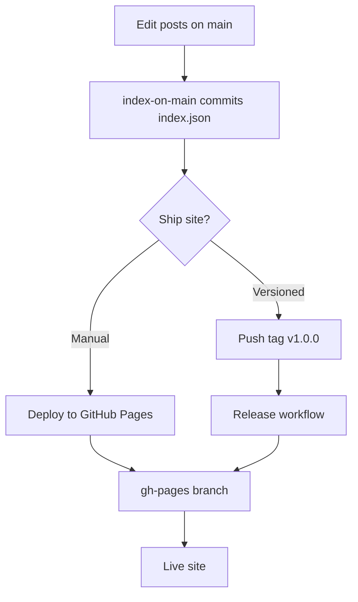

Not using GitHub Actions? See **[Full custom hosting](Full-Custom-Hosting)**, download a release zip, upload anywhere, and connect a separate data repo if you want.

## Deploy methods

| Method | When to use |
|--------|-------------|
| **Update index on main** | Auto on push when posts/scripts change; updates `index.json` on `main` only. |
| **Update data on gh-pages** | Auto after index on main, or manual; syncs full `data/` to `gh-pages`. |
| **Deploy to GitHub Pages** | Manual full deploy (WASM + data + images) to `gh-pages`. |
| **Release** (`v*` tags) | GitHub Release + zip + deploy to `gh-pages`. |

## Static hosting

BoneLog is a static WASM app. Any host with SPA fallback works.

| Host | Notes |
|------|--------|
| **GitHub Pages** | `gh-pages` branch; set `BaseDir` to your repo path. Deploy sets `<base href>` in `index.html` and `404.html`. |
| **Netlify / Cloudflare Pages** | Deploy publish output; redirect `/*` → `index.html`. |
| **Azure Static Web Apps** | Configure `navigationFallback`. |
| **IIS / nginx** | Fallback to `index.html` for client routes. |

**Same-origin data:** use `"BaseDataPath": "data/"` so posts load from the same host as the app.

**Separate data host:** set `BaseDataPath` to a full URL (CDN, second bucket, another repo). The WASM site and `data/` can live on different domains. CORS must allow your site.

When data is separated, **`index.json` must live on the data host** and stay updated when posts change — run `GenerateIndex.cs` locally or use the **Update index on main** workflow (if posts are in this repo), then deploy the `data/` folder to wherever `BaseDataPath` points. See [Paths & addresses — separating website and data](Paths).

## See also

- [Paths & addresses](Paths)
- [Quick start](Quick-Start)
- [GitHub Actions workflows](Workflows)
- [Documentation index](Index)
